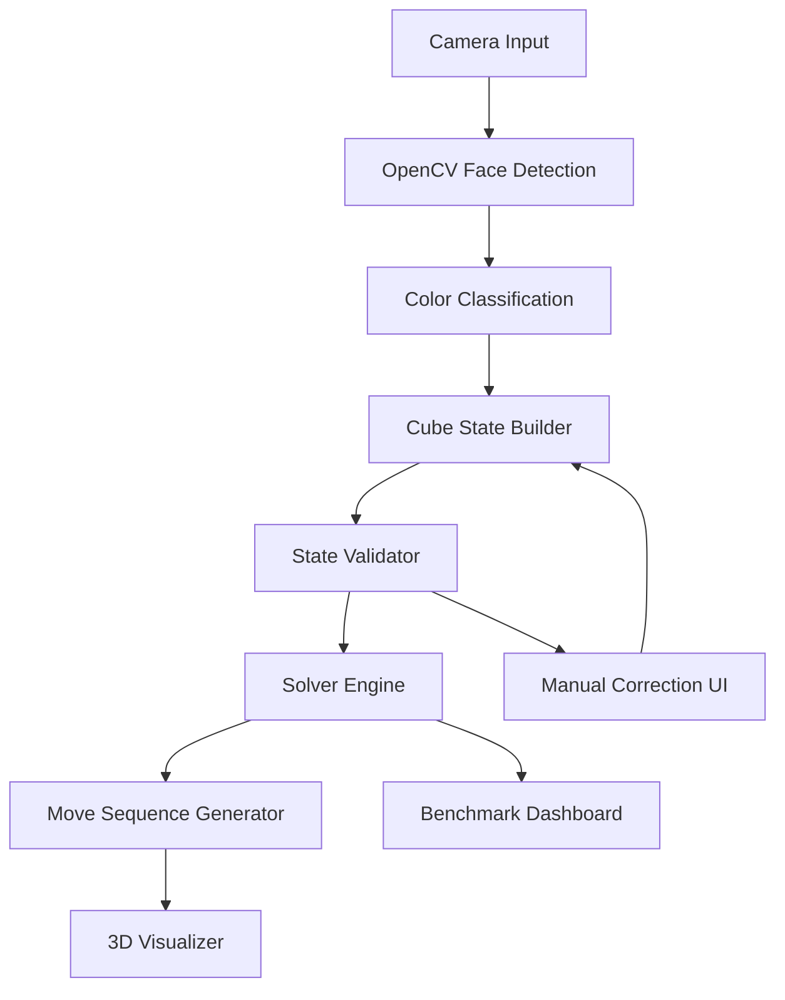

<div align="center">

# 🧩 CubeVision AI

### Rubik's Cube Scanner, Solver & 3D Step Visualizer

**Camera scanner + OpenCV color detection + cube-state validation + heuristic solving engine + interactive 3D playback**


**CubeVision AI turns a physical Rubik's Cube into a validated digital state, computes optimized moves, and teaches the solution through a smooth 3D visualizer.**

[Core Idea](#-core-idea) •
[Project Phases](#-project-phases) •
[Features](#-features) •
[Tech Stack](#-tech-stack) •
[Architecture](#-system-architecture) •
[OOP Design](#-oop-design) •
[Run Locally](#-run-locally)

</div>

---

## 🎯 Core Idea

CubeVision AI is more than a solver. It is a complete vision-to-solution system:

```text
Camera Scan
   ↓
OpenCV Face Detection
   ↓
HSV Color Classification
   ↓
Cube State Builder
   ↓
Validity Checker
   ↓
IDA* / Kociemba Solver
   ↓
Move Sequence Generator
   ↓
Three.js Step Visualizer
```

The user scans all six faces of a Rubik's Cube. The app detects sticker colors, validates whether the cube is physically solvable, generates an optimized solution, and animates every move in 3D.

---

## 🗓 Project Phases

| Phase | Focus |
| --- | --- |
| Phase 1 | Manual cube input, cube model, move notation, and basic validation ✅ |
| Phase 2 | OpenCV scanner, HSV color calibration, and 3x3 sticker detection |
| Phase 3 | Solver engine with IDA* / Kociemba-style optimized search |
| Phase 4 | Three.js visualizer with next, previous, play, and reset controls |
| Phase 5 | Benchmark dashboard, mistake detection, and Learn Mode |

---

## ✨ Features

### 1. 📷 Camera-Based Cube Scanner

| Capability | Details |
| --- | --- |
| Face capture | Scan each of the six cube faces using a webcam or mobile camera |
| Sticker detection | Detect the 3x3 sticker grid for every face |
| Piece mapping | Identify centers, edges, and corners from scanned faces |
| Guided flow | Show scan progress and prevent missing or duplicated faces |

### 2. 🎨 OpenCV Color Detection

| Color | Detection Strategy |
| --- | --- |
| White | Brightness and low-saturation HSV range |
| Yellow | Hue-range thresholding with lighting correction |
| Red | Dual hue-range handling for HSV wrap-around |
| Orange | Hue and saturation threshold separation from red |
| Blue | Stable hue threshold with shadow tolerance |
| Green | Hue thresholding with saturation normalization |

CubeVision AI supports calibration because real lighting is unpredictable. Users can sample center colors once, then the classifier adapts HSV thresholds for the current environment.

### 3. ✅ Cube State Validator

Before solving, the validator checks whether the scanned cube state is legal.

| Validation Check | Why It Matters |
| --- | --- |
| Sticker count | Ensures each color appears exactly nine times |
| Center uniqueness | Confirms all six face centers are distinct |
| Edge legality | Rejects duplicated, missing, or impossible edge pieces |
| Corner legality | Rejects impossible corner positions and orientations |
| Solvability | Detects states that cannot exist on a real cube |

### 4. 🧠 Optimized Solver Engine

The solving engine is designed around graph search, state compression, and heuristics.

| Mode | Algorithm |
| --- | --- |
| Guided | Layer-by-layer beginner method |
| Optimized | Kociemba two-phase style search |
| Advanced | IDA* with admissible heuristic tables |

Recommended production path: use a C++ OOP solver compiled to WebAssembly so the browser UI stays fast while search-heavy logic remains efficient.

### 5. 🪄 Step-by-Step Move Generator

CubeVision AI outputs standard cube notation:

```text
R U R' U'
F R U R' U' F'
```

For each step, the app can show:

| Output | Example |
| --- | --- |
| Current phase | Cross, F2L, OLL, PLL, or phase-1/phase-2 search |
| Move goal | Pair an edge, orient corners, reduce state group, etc. |
| Remaining moves | Count down through the generated solution |
| Explanation | Human-readable reason for the next move |

### 6. 🧊 3D Cube Visualizer

The visualizer makes the solution easy to demo and easy to follow.

| Control | Behavior |
| --- | --- |
| Rotate | Inspect the cube from any angle |
| Next / Previous | Step through the solution one move at a time |
| Play | Animate the full solution automatically |
| Reset | Return to the scanned starting state |
| Highlight | Emphasize the face or layer affected by each move |

### 7. 📊 Algorithm Benchmarking Dashboard

Compare solver strategies with measurable output.

| Algorithm | Metrics |
| --- | --- |
| BFS | Baseline search depth and memory growth |
| IDDFS | Iterative deepening behavior |
| A* | Heuristic quality and node expansion |
| IDA* | Memory-efficient heuristic search |
| Kociemba | Solution length and runtime efficiency |

Dashboard metrics include solution length, time taken, memory used, and nodes explored.

### 8. 🧩 Manual Cube Input Fallback

When camera detection struggles, users can manually fill sticker colors on a 2D cube net. This keeps the app usable in poor lighting, low-resolution cameras, or unusual cube sticker designs.

### 9. 🔁 Mistake Detection

After the user performs moves physically, the app can scan the cube again and compare the observed state against the expected state.

```text
Expected move: U'
Detected state: U

Action: warn the user and offer to recalculate from the current state.
```

### 10. 🎓 Learn Mode

Learn Mode explains why the solution works.

| Topic | Explanation |
| --- | --- |
| Cross | Build the first-layer edge structure |
| F2L | Pair corners and edges efficiently |
| OLL | Orient the last-layer stickers |
| PLL | Permute the final pieces |
| Search | Show how heuristic pruning reduces the search space |

---

## 🛠 Tech Stack

| Layer | Recommended Tools |
| --- | --- |
| Frontend | React, TypeScript, Vite |
| 3D Visualizer | Three.js, React Three Fiber |
| Vision | OpenCV, HSV thresholding, contour detection |
| Solver Core | C++, OOP, IDA*, Kociemba-style search |
| Browser Runtime | WebAssembly |
| API Option | FastAPI, Flask, or Node.js |
| Prototype Option | Python + OpenCV |
| Desktop Option | C++ + Qt + OpenCV |

Best production architecture:

```text
React + Three.js frontend
C++ solver compiled to WebAssembly
OpenCV-powered scanner
Benchmark dashboard for algorithm comparison
```

---

## 🏗 System Architecture



---

## 🧱 OOP Design

| Class | Responsibility |
| --- | --- |
| `Cube` | Stores the full cube state and applies moves |
| `Face` | Represents one cube face and its nine stickers |
| `Sticker` | Stores color and position metadata |
| `Move` | Encodes standard notation and layer rotation |
| `Scanner` | Captures frames and extracts face grids |
| `ColorClassifier` | Converts sampled pixels into cube colors |
| `Validator` | Checks color counts, piece legality, and solvability |
| `Solver` | Generates optimized solution sequences |
| `Heuristic` | Provides pruning and search guidance |
| `Visualizer` | Animates cube state transitions |
| `Benchmark` | Measures algorithms by speed, memory, and solution length |

---

## 🚀 Run Locally

```bash
git clone https://github.com/vamshichethan/CubeVision-AI-Rubik-s-Cube-Scanner-Solver.git
cd CubeVision-AI-Rubik-s-Cube-Scanner-Solver
npm install
npm run dev
```

Open the local app:

```text
http://localhost:5173
```

For a C++ / WebAssembly solver module:

```bash
emcmake cmake -S solver -B build
cmake --build build
```

---

## 🧪 Verification Checklist

- Scan all six faces without duplicate center colors.
- Confirm each detected color appears exactly nine times.
- Validate edge and corner legality before solving.
- Generate move notation and apply it to an internal cube state.
- Animate every move in the 3D visualizer.
- Compare BFS, IDDFS, A*, IDA*, and Kociemba-style search metrics.
- Re-scan after physical moves to detect user mistakes.

---

## ⭐ Project Strength

CubeVision AI demonstrates computer vision, graph algorithms, heuristic search, C++ OOP, optimization, system design, visual simulation, and real-world error handling in one cohesive product.

It is a strong SDE project because it invites deep technical discussion around state representation, BFS vs A*, admissible heuristics, OpenCV preprocessing, search pruning, WebAssembly performance, and UX recovery paths when camera input fails.

---

<div align="center">

### 🧩 CubeVision AI

**Scan the cube. Validate the state. Solve it. Watch every move.**

</div>
